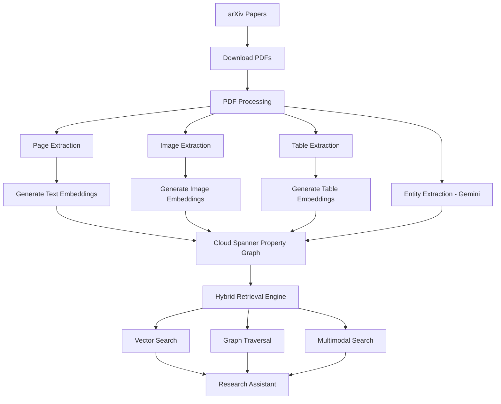
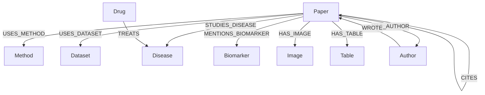
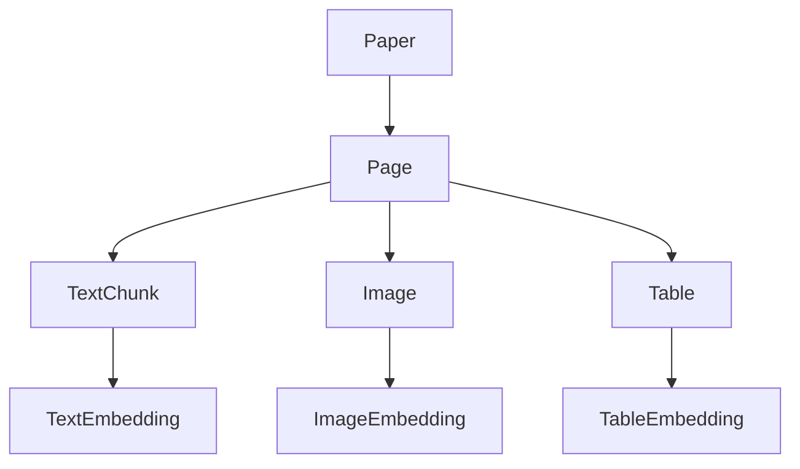
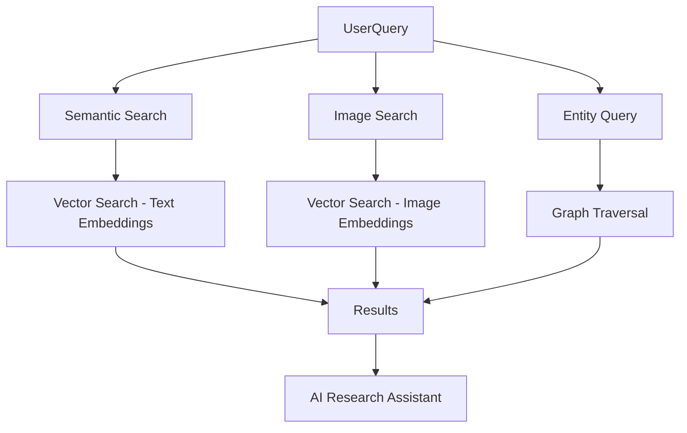
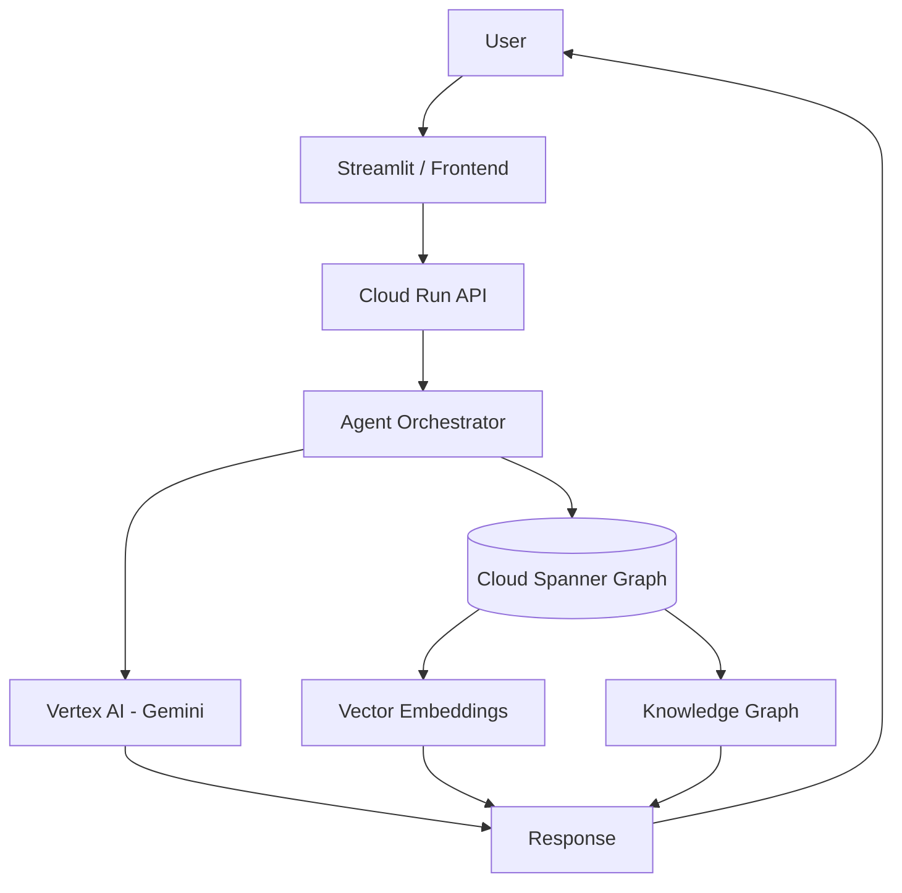
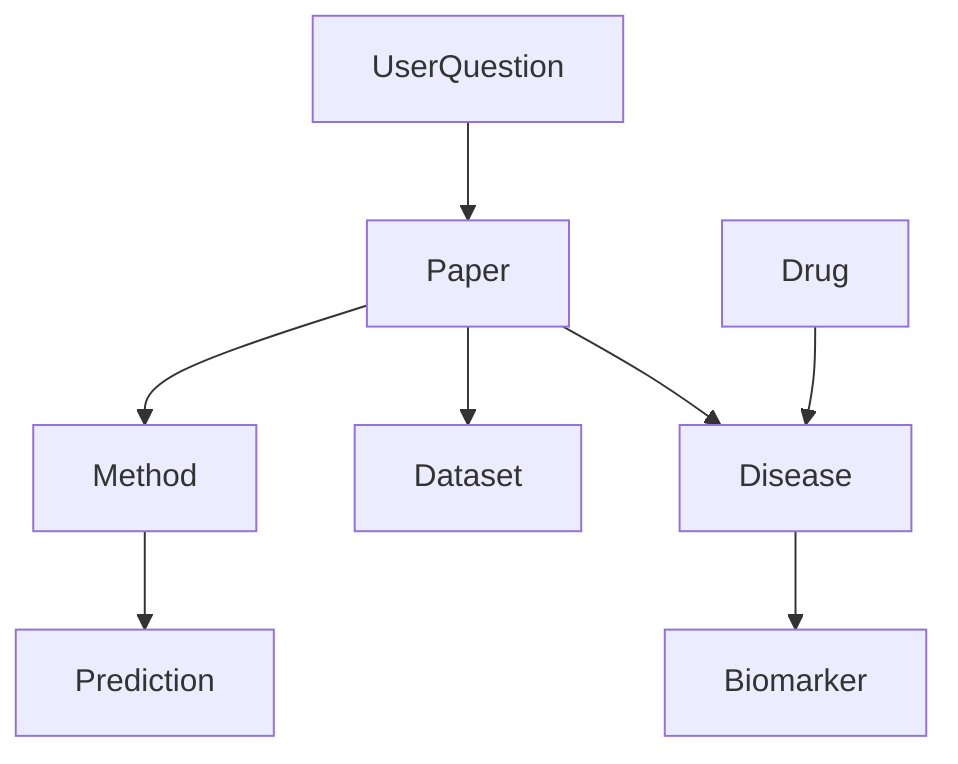

# search4cure-live

# Search4Cure

Search4Cure is a multimodal biomedical research assistant that builds a knowledge graph from research papers.

The system ingests research papers from arXiv, extracts structured information, generates embeddings, and stores everything in Google Cloud Spanner Property Graph.

It enables:

-  Semantic search

-  Entity-based search

- Image retrieval

- Table retrieval

- Knowledge graph exploration

---

## Architecture Diagram


## Data Processing Pipeline
```mermaid
flowchart TD

A[arXiv] --> B[download_pdfs()]
B --> C[extract_pages()]
C --> D[extract_images()]
C --> E[extract_tables()]

C --> F[generate_text_embeddings()]
D --> G[generate_image_embeddings()]
E --> H[generate_table_embeddings()]

C --> I[extract_entities_with_llm()]

F --> J[build_graph_nodes_edges()]
G --> J
H --> J
I --> J

J --> K[insert_into_spanner()]
```

## Knowledge Graph Schema



## Multimodal Document Structure



## Retrieval Architecture



## System Deployment Architecture



## Research Query Reasoning



| Component       | Purpose                    |
| --------------- | -------------------------- |
| arXiv ingestion | Collect research papers    |
| PDF processing  | Extract multimodal content |
| Embeddings      | Enable semantic search     |
| Spanner Graph   | Store relationships        |
| Vector Search   | Retrieve relevant content  |
| Graph Traversal | Multi-hop reasoning        |

Example query reasoning:

Which papers predict diabetes progression?

Paper
 → Method (LSTM)
 → Dataset (UK Biobank)
 → Disease (Type 2 Diabetes)


# System Architecture

arXiv Papers
     │
     ▼
PDF Processing
 ├─ Page extraction
 ├─ Image extraction
 ├─ Table extraction
 └─ Entity extraction (Gemini)
     │
     ▼
Embedding Generation
 ├─ Text embeddings
 ├─ Image embeddings (CLIP / multimodal)
 └─ Caption embeddings
     │
     ▼
Cloud Spanner Property Graph
 ├─ Papers
 ├─ Pages
 ├─ Images
 ├─ Tables
 └─ Entities
     │
     ▼
Hybrid Retrieval
 ├─ Vector search
 ├─ Graph traversal
 └─ Multimodal search

## Knowledge Graph Structure

The system builds a biomedical research knowledge graph.

Paper
 ├── USES_METHOD → Method
 ├── USES_DATASET → Dataset
 ├── STUDIES_DISEASE → Disease
 ├── MENTIONS_BIOMARKER → Biomarker
 ├── HAS_IMAGE → Image
 ├── HAS_TABLE → Table
 └── HAS_AUTHOR → Author

### Multimodal Hierarchy

Paper
 ├── Page (text + embedding)
 │      ├── Images (image embeddings)
 │      └── Tables (table embeddings)
 │
 ├── Methods
 ├── Diseases
 ├── Datasets
 ├── Biomarkers
 └── Drugs

## Retrieval Capabilities

| Query Type     | Retrieval Method   |
| -------------- | ------------------ |
| Semantic text  | Page embeddings    |
| Image search   | Image embeddings   |
| Caption search | Caption embeddings |
| Table search   | Table embeddings   |
| Entity query   | Graph traversal    |


## Repository Structure

search4cure/
│
├── backend/
│   │
│   ├── ingestion/
│   │   ├── arxiv_loader.py
│   │   ├── pdf_processor.py
│   │   ├── page_extractor.py
│   │   └── entity_extractor.py
│   │
│   ├── embeddings/
│   │   ├── text_embeddings.py
│   │   ├── image_embeddings.py
│   │   └── multimodal_processor.py
│   │
│   ├── graph/
│   │   ├── graph_builder.py
│   │   ├── node_builder.py
│   │   └── edge_builder.py
│   │
│   ├── database/
│   │   ├── spanner_client.py
│   │   ├── spanner_writer.py
│   │   └── schema.sql
│   │
│   ├── retrieval/
│   │   ├── vector_search.py
│   │   ├── graph_queries.py
│   │   └── hybrid_retriever.py
│   │
│   ├── pipeline/
│   │   ├── build_graph_from_arxiv.py
│   │   ├── process_pdfs_pipeline.py
│   │   └── run_full_ingestion.py
│   │
│   └── api/
│       └── rag_api.py
│
├── scripts/
│   ├── setup_spanner_db.py
│   ├── setup_data.py
│   └── download_arxiv_papers.py
│
├── notebooks/
│   ├── test_arxiv_loader.ipynb
│   ├── test_embeddings.ipynb
│   └── test_entity_extraction.ipynb
│
├── data/
│   ├── pdfs/
│   ├── images/
│   └── metadata/
│
├── tests/
│   ├── test_graph_builder.py
│   ├── test_embeddings.py
│   └── test_arxiv_loader.py
│
├── requirements.txt
├── pyproject.toml
└── README.md


# Installation

## Install dependencies


pip install -r requirements.txt


or


uv sync


---

# Environment variables

Create `.env`


PROJECT_ID=search4cure-diabetes
INSTANCE_ID=diabetes-research-network
DATABASE_ID=research-graph-db
GRAPH_NAME=DiabetesResearchGraph
REGION=us-central1

## Google Cloud Setup

See [docs/cloud_setup.md](docs/cloud_setup.md) for full instructions on enabling required services and preparing the Google Cloud project.


---

# Create Spanner database


# Run ingestion pipeline

arXiv
   ↓
download_pdfs()
   ↓
extract_pages()
   ↓
extract_images()
   ↓
generate_text_embeddings()
   ↓
generate_image_embeddings()
   ↓
extract_entities_with_llm()
   ↓
build_graph_nodes_edges()
   ↓
insert_into_spanner()


python backend/pipeline/run_full_ingestion.py


The pipeline will:

• download papers from arXiv  
• extract pages, images, and tables  
• extract biomedical entities with Gemini  
• generate embeddings  
• build the knowledge graph  
• insert everything into Cloud Spanner  

---

# Technologies

- Python
- Google Cloud Spanner
- Vertex AI Gemini
- CLIP embeddings
- Camelot (table extraction)
- PyMuPDF (PDF processing)
- LangChain ArXiv loader


## Graph Visualization

See how to explore the graph in Spanner Studio:

👉 [Graph Visualization Guide](docs/graph-visualization.md)


## License

MIT License